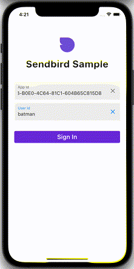

# [Sendbird](https://sendbird.com) Sendbird Keyword Triggered Animations in Flutter

[](https://flutter.dev/)
[](https://dart.dev/)

Sendbird provides an easy-to-use Chat API, Chat SDKs, and a fully-managed chat platform on the backend that provides delivery receipts, offline messaging, translation, moderation tools, and analytics. 

This sample demonstrates how to trigger third-party animation effects based on keywords from incoming chat messages. In particular, group message [metaArrays](https://sendbird.com/docs/chat/v3/flutter/guides/group-channel-advanced#2-add-extra-data-to-a-message?&utm_source=github&utm_medium=referral&utm_campaign=repo&utm_content=sendbird-confetti-flutter-sample) are used to track when particular users have or have not yet seen a particular keyword trigger to prevent duplicate triggers. 

See [Sendbird's Flutter SDK](https://github.com/sendbird/sendbird-sdk-flutter) for more information on implementing Sendbird chat into your own Flutter applications. 

<br />

## Table of contents

  1. [Introduction](#introduction)
  1. [Requirements](#requirements)
  1. [Getting started](#getting-started)
  1. [Getting help](#getting-help)
  1. [Hiring](#we-are-hiring)

<br />

## Introduction

This sample consists of several features, including:

* Connecting and disconnecting from Sendbird 
* Create / fetch / update a group channel  
* Send / update / delete a message (user and file message)
* Receive channel events and handle appropriately
* Push notification 

<br />

<p align="center">

</p>

<br />

## Requirements
- Dart 2.14.0+
- Flutter 2.5.0+


## Running
Once Flutter has been setup, check if there are any simulators/emulators/devices available to run on with:
`flutter devices`

Which will output something similar to:
```
iPhone 12 mini (mobile)                      • 487C50F3-5F34-4D7E-85BB-911977A813D3 • ios
Chrome (web)                                 • chrome                               • web-javascript
```

Execute `flutter run -d <device_id>` to run the app on a given device (ie `flutter run -d FB`)

The first screen should then appear:


## Getting Help
Check out the Official Sendbird [Flutter docs](https://sendbird.com/docs/chat/v3/flutter/quickstart/send-first-message?&utm_source=github&utm_medium=referral&utm_campaign=repo&utm_content=sendbird-confetti-flutter-sample) and Sendbird's [Developer Portal](https://sendbird.com/developer?&utm_source=github&utm_medium=referral&utm_campaign=repo&utm_content=sendbird-confetti-flutter-sample) for tutorials and videos. If you need any help in resolving any issues or have questions, visit our [community forums](https://community.sendbird.com?&utm_source=github&utm_medium=referral&utm_campaign=repo&utm_content=sendbird-confetti-flutter-sample).

<br />

## We are Hiring!
Sendbird is made up of a diverse group of humble, friendly, and hardworking individuals united by a shared purpose to build the next generation of mobile & social technologies. Join our team remotely or at one of our locations in San Mateo, Seoul, New York, London, and Singapore. More information on a [careers page](https://sendbird.com/careers?&utm_source=github&utm_medium=referral&utm_campaign=repo&utm_content=sendbird-confetti-flutter-sample).